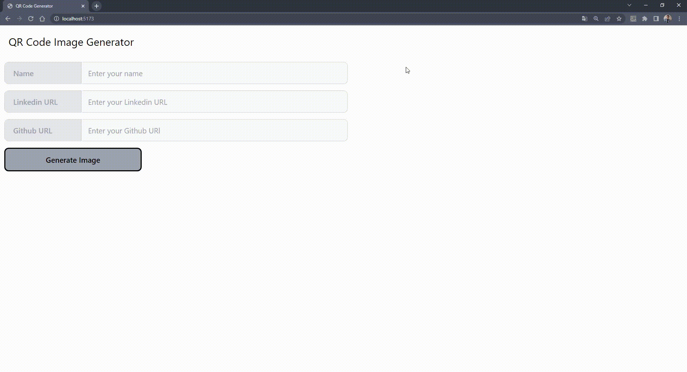

# QR CODE Generator

Essa é aplicação que gera 

# 🔖 Sumário

- [🚀 Começando](#começando)
- [📋 Pré-requisitos](#pré-requisitos)
- [🔧 Instalação](#instalação)
- [🛠️ Construído com](#construído-com)
- [🎥 Imagens](#imagens)
- [📌 Versão](#versão)

<div id='começando'/> 

## 🚀 Começando

Essas instruções permitirão que você obtenha uma cópia do projeto em operação na sua máquina local para fins de desenvolvimento e teste.

No terminal e de preferência na mesma pasta, clone o repositório:

```sh
git git@github.com:Raph2ll/QR-Code-Generator.git
```

<div id='pré-requisitos'/>

### 📋 Pré-requisitos

Você ira precisar dessas tecnologias na sua máquina.

```sh
[Javascript, NPM, Node.js, MongoDB, Git e GitHub]
```

<div id='instalação'/>

### 🔧 Instalação

Após baixar o repositório você vai precisar.

1. Entrar na pasta do repositório clonado:

```sh
cd QR-Code-Generator
```

2. Instale as dependências:

```sh
npm install 
```

3. Inicie a aplicação:

```sh
npm run dev
```

5. Agora é só entrar no endereço do local host:

```sh
http://localhost:5173
```

## 🛠️ Construído com

Ferramentas utilizadas para criar o projeto:

- **Linguagem:** 
  - [JavaScript](https://www.javascript.com)

 - **Frontend**: 
    - [React.Js](https://pt-br.reactjs.org) - Framework Web
    - [Vite](https://vitejs.dev) - Ferramenta de Desenvolvimento
    - [Tailwind](https://tailwindcss.com) - Framework de Estilização CSS
    - [Postcss](https://postcss.org) - Uma ferramenta para transformar CSS com JavaScript
    - [Eslint](https://eslint.org) - Linter de manutenção de código
    - [Axios](https://axios-http.com/ptbr/docs/intro) - Ajuda a consumir API's
    - [React-Qr-Code](https://www.npmjs.com/package/react-qr-code?activeTab=readme) - Gera QR code com base em string

<div id='imagens'/>

## 🎥 Imagens

### Imagens do projeto 



>  Gif do projeto funcionando.

<div id='versão'/>

## 📌 Versão

Utilizei [NPM](https://www.npmjs.com) :package: para controle de versão das dependências.

---
⌨️ com ❤️ por [Raphael](https://github.com/Raph2ll)
